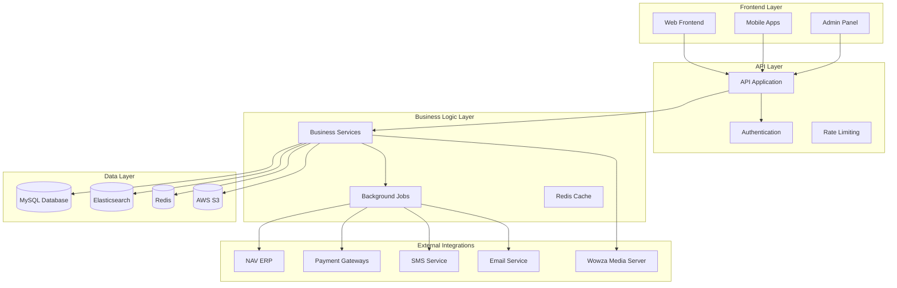

id: PROJECT_OVERVIEW
title: PROJECT OVERVIEW
# Rahvaraamat E-commerce Backend - Project Overview

## 1.1 Project Purpose and Business Context

### Business Purpose
**Rahvaraamat** is Estonia's largest bookstore chain and digital content provider. This ecommerce backend powers their comprehensive online platform that serves multiple business models and customer segments.

### Business Problem Solved
The platform addresses the complex challenge of managing a **hybrid retail business** that combines:
- **Traditional physical retail** (bookstores across Estonia)
- **Digital content distribution** (e-books, audiobooks)
- **Subscription services** (monthly/yearly digital content access)
- **B2B wholesale operations** (supplying other businesses)

### Target Users
- **End Customers**: Individual consumers, students, professionals, audiobook listeners, e-book readers
- **Business Customers**: Schools, libraries, corporate clients, wholesale partners
- **Internal Users**: Store staff, administrators, content managers, customer service
- **Vendors**: Publishers, authors, content creators

### Business Model
- **Physical Product Sales**: Books, office equipment, gifts, music, movies, games
- **Digital Content Sales**: E-books with DRM protection, audiobook downloads and streaming
- **Subscription Services**: Monthly/yearly audio and e-book subscription plans
- **B2B Services**: Wholesale pricing, bulk order processing, corporate account management

## 1.2 All Features Documentation

### User Module
- **Multi-role Authentication**: Admin, Vendor, Client, Customer, Company, Wholesale roles
- **User Management**: Registration, login, profile management, password reset
- **Role-based Access Control**: Granular permissions for different user types
- **Social Login**: OAuth2 integration for external authentication
- **Client Account Types**: Simple customers, business clients, wholesale clients

### Product Module
- **Multi-format Products**: Books, e-books, audiobooks, office equipment, music, movies, games
- **Product Management**: CRUD operations, categorization, pricing, inventory
- **Digital Content**: DRM protection, file management, streaming capabilities
- **Product Search**: Elasticsearch-powered search with filters and faceting
- **Product Availability**: Real-time stock tracking, availability status management
- **Product Images**: Multi-image support, thumbnail generation, AWS S3 storage

### Order Module
- **Order Processing**: Complete order lifecycle management
- **Multi-channel Orders**: Web, mobile, physical store integration
- **Order Status Tracking**: Pending, processing, completed, failed, refunded states
- **Order Products**: Individual product line management
- **Order History**: Customer order history and tracking
- **Order Notifications**: Email and SMS notifications

### Payment Module
- **Multiple Payment Gateways**: Swedbank, SEB, LHV, Coop, Luminor
- **Open Banking**: PSD2 compliant APIs
- **Subscription Billing**: Automatic recurring payments
- **Payment Processing**: Transaction handling, refund processing
- **Payment Security**: PCI compliance, encryption, fraud detection

### Basket Module
- **Shopping Cart**: Add, remove, update products
- **Cart Persistence**: Redis-based cart storage
- **Cart Validation**: Stock availability, pricing validation
- **Cart Merging**: Guest to authenticated user cart merging
- **Cart Cleanup**: Automatic removal of unavailable products

### Subscription Module
- **Audio Subscriptions**: Credit-based and unlimited plans
- **E-book Subscriptions**: Shelf-based access with size limits
- **Trial Management**: Free trial periods and activation
- **Usage Tracking**: Detailed usage analytics and reporting
- **Revenue Sharing**: Publisher revenue distribution

### Admin Module
- **User Management**: Admin, vendor, customer user management
- **Product Management**: Product catalog, pricing, inventory management
- **Order Management**: Order processing, status updates, refunds
- **Content Management**: Categories, pages, media management
- **Analytics Dashboard**: Sales, user, subscription analytics
- **System Configuration**: Settings, permissions, integrations

### Audio Module
- **Audiobook Streaming**: Wowza Media Server integration
- **Audio File Management**: Upload, processing, storage
- **Listening Progress**: Track user listening progress
- **Audio Credits**: Credit-based purchasing system
- **Audio Shelf**: User's audiobook collection management

### E-Book Module
- **E-book Management**: EPUB file handling and processing
- **DRM Protection**: LCP (License Content Protection) integration
- **E-book Shelf**: User's e-book collection management
- **Reading Progress**: Track user reading progress
- **Download Management**: Secure file downloads

### Vendor Module
- **Vendor Management**: Publisher and vendor account management
- **Product Upload**: Vendor product submission and approval
- **Revenue Tracking**: Sales reporting and commission calculation
- **Vendor Portal**: Self-service vendor interface

### STACC Module (Point of Sale)
- **Store Integration**: Physical store inventory management
- **Sales Tracking**: Real-time sales data synchronization
- **Product Availability**: Store-specific stock management
- **Basic Authentication**: Store staff authentication

## 1.3 Business Understanding of the Project

### User Roles and Interactions

#### Customer Journey
1. **Registration/Login**: Customer creates account or logs in
2. **Product Discovery**: Browse categories, search products, view recommendations
3. **Shopping Cart**: Add products to basket, manage quantities
4. **Checkout**: Select delivery method, payment, complete purchase
5. **Order Processing**: Order confirmation, payment processing, fulfillment
6. **Digital Access**: Download e-books, stream audiobooks, access subscriptions

#### Business Customer Journey
1. **Company Registration**: Business account creation with verification
2. **Wholesale Pricing**: Access to wholesale pricing and bulk discounts
3. **Bulk Orders**: Large quantity orders with special processing
4. **Account Management**: Employee management, credit limits, payment terms

#### Vendor Journey
1. **Vendor Registration**: Publisher/vendor account creation
2. **Product Submission**: Upload product information and files
3. **Approval Process**: Admin review and approval of products
4. **Sales Tracking**: Monitor sales performance and revenue

### Product Lifecycle
1. **Product Creation**: Admin or vendor creates product entry
2. **Content Upload**: Digital files uploaded and processed
3. **Pricing Setup**: Set retail and wholesale pricing
4. **Inventory Sync**: Real-time stock synchronization with NAV
5. **Availability Management**: Automatic availability status updates
6. **Sales Processing**: Order processing and inventory deduction

### Order Lifecycle
1. **Order Creation**: Customer places order through web/mobile
2. **Payment Processing**: Payment gateway integration and processing
3. **Order Validation**: Stock availability, pricing validation
4. **Fulfillment**: Physical shipping or digital delivery
5. **Status Updates**: Real-time order status tracking
6. **Completion**: Order completion and customer feedback

## 1.4 Business Logic

### Inventory Management Rules
- **Real-time Sync**: Stock levels synchronized with NAV ERP every 35 minutes
- **Availability Thresholds**: Minimum quantity limits per product type and language
- **Automatic Status Updates**: Products marked as available/out of stock based on thresholds
- **Shop-specific Stock**: Individual store inventory tracking
- **Stock Calculation Allowance**: Configurable shops for delivery calculations

### User Role Permissions
- **Admin Roles**: Master admin, purchasing manager, employee, seller
- **Vendor Roles**: Author, employee, master user
- **Client Roles**: Customer, company master, wholesale master, company employee
- **Permission-based Access**: Granular permissions for different operations

### Order Processing Rules
- **Payment Validation**: Orders require successful payment before processing
- **Stock Reservation**: Stock reserved during order processing
- **Status Progression**: Pending → Processing → Completed/Failed
- **Failed Order Handling**: Automatic rollback of failed orders
- **Refund Processing**: Credit-based refunds for digital products

### Subscription Business Logic
- **Credit System**: Audio credits for audiobook purchases
- **Shelf Limits**: Maximum items in e-book shelf
- **Trial Periods**: Free trial management with automatic billing
- **Usage Tracking**: Detailed analytics for subscription usage
- **Revenue Sharing**: Publisher revenue distribution based on usage

### Product Availability Logic
- **Permanently Out of Stock**: NAV "Sold Out" field or zero quantities
- **Temporarily Out of Stock**: Below minimum threshold
- **Available**: Above minimum threshold
- **Coming Soon**: New products without stock information
- **Shop Availability**: Individual store stock levels

## 1.5 High-Level Architecture



### Architecture Components

#### API Layer
- **RESTful API**: Comprehensive API for frontend and mobile apps
- **Authentication**: JWT tokens, OAuth2, role-based access
- **Rate Limiting**: Request limits per user type
- **CORS Support**: Cross-origin resource sharing

#### Business Logic Layer
- **Service Classes**: Encapsulated business logic
- **Queue System**: Background job processing
- **Caching**: Redis-based application caching
- **Event System**: Event-driven architecture

#### Data Layer
- **MySQL**: Primary relational database
- **Elasticsearch**: Search and indexing engine
- **Redis**: Session storage and caching
- **AWS S3**: File storage for media

#### External Integrations
- **NAV ERP**: Microsoft Dynamics integration
- **Payment Gateways**: Multiple Estonian banks
- **Media Services**: Wowza for audio streaming
- **Communication**: SMS and email services

## 1.6 Technology Stack

### Backend Framework
- **PHP 8.0+**: Modern PHP with strict typing
- **Yii2 Framework**: MVC framework with advanced template
- **Composer**: Dependency management

### Database & Storage
- **MySQL 8.0+**: Primary database
- **Redis 6.0+**: Caching and session storage
- **Elasticsearch 7.16.2**: Search and indexing
- **AWS S3**: Cloud file storage

### Key Libraries & Dependencies

#### Core Framework
- `yiisoft/yii2`: ^2.0.49
- `yiisoft/yii2-bootstrap`: ^2.0.1
- `yiisoft/yii2-swiftmailer`: ~2.1.0

#### Authentication & Security
- `firebase/php-jwt`: ^6.0
- `rhertogh/yii2-oauth2-server`: ^1.0
- `web-token/jwt-framework`: ^2.2
- `phpseclib/phpseclib`: ^3.0.22

#### File Processing & Media
- `dompdf/dompdf`: ^2.0
- `phpoffice/phpspreadsheet`: ^1.28.0
- `yiisoft/yii2-imagine`: ~2.3.0
- `wapmorgan/mp3info`: ~0.1.0
- `falahati/php-mp3`: dev-master

#### Search & Indexing
- `ruflin/elastica`: ~7.1.0
- `yiisoft/yii2-elasticsearch`: ~2.1.0

#### External APIs & Services
- `guzzlehttp/guzzle`: ^7.4.0
- `messente/messente-api-php`: ^3.1
- `aws/aws-sdk-php`: ~3.198.0
- `facebook/php-business-sdk`: ~16.0.0

#### Payment Processing
- `swiftmade/omnipay-everypay`: ^0.4.1
- `endroid/qr-code`: ^4.8

#### Development Tools
- `yiisoft/yii2-debug`: ^2.1.19
- `yiisoft/yii2-gii`: ^2.2.5
- `codeception/codeception`: ~4.1.0
- `rector/rector`: 0.17.13

### Infrastructure
- **Docker**: Pending Setup
- **Nginx**: Web server
- **PHP-FPM**: PHP processing
- **MariaDB 11.4**: Database server

### External Services
- **NAV (Microsoft Dynamics)**: ERP integration
- **Payment Gateways**: Swedbank, SEB, LHV, Coop, Luminor
- **SMS Service**: Messente API
- **Email Service**: SwiftMailer
- **Audio Streaming**: Wowza Media Server
- **File Storage**: AWS S3

## 1.7 Directory Structure

```
ecommerce-backend/
├── admin/                    # Admin panel application
│   ├── controllers/         # Admin controllers
│   ├── models/             # Admin-specific models
│   ├── views/              # Admin views
│   ├── modules/            # Admin modules (audio, ebook, vendor, etc.)
│   └── web/                # Admin web assets
├── api/                     # API application
│   ├── controllers/        # API controllers
│   ├── models/            # API-specific models
│   ├── serializers/       # API response serializers
│   ├── modules/           # API modules (audio, ebook, stacc)
│   └── web/               # API web assets
├── common/                  # Shared components
│   ├── models/            # Database models
│   ├── components/        # Shared components
│   ├── services/          # Business services
│   ├── enums/            # Enumerations
│   ├── managers/         # Business logic managers
│   ├── synchronizations/ # External system sync
│   └── helpers/          # Utility helpers
├── console/                 # Console application
│   ├── controllers/       # Console commands
│   ├── migrations/        # Database migrations
│   └── scripts/           # Utility scripts
├── environments/           # Environment configurations
├── docker/                 # Docker configuration
├── storage/               # File storage
└── tests/                 # Test files
```

### Key Directory Roles

#### `/admin`
- **Purpose**: Administrative interface for managing the platform
- **Key Features**: User management, product catalog, order processing, analytics
- **Modules**: Audio, E-book, Vendor, Subscription management

#### `/api`
- **Purpose**: RESTful API for frontend and mobile applications
- **Key Features**: Authentication, product search, order management, basket
- **Modules**: Audio streaming, E-book downloads, STACC integration

#### `/common`
- **Purpose**: Shared code and business logic
- **Key Features**: Database models, services, utilities, external integrations
- **Components**: Authentication, caching, file storage, payment processing

#### `/console`
- **Purpose**: Command-line tools and background processing
- **Key Features**: Database migrations, cron jobs, external sync
- **Commands**: Order processing, inventory sync, email sending

#### `/environments`
- **Purpose**: Environment-specific configurations
- **Key Features**: Development, staging, production settings
- **Configurations**: Database, cache, external service settings

#### `/docker`
- **Purpose**: Containerized deployment configuration
- **Key Features**: Multi-service setup, development environment
- **Services**: Web server, database, cache, search engine

---

*This comprehensive overview provides a complete understanding of the Rahvaraamat e-commerce backend project, its business purpose, technical architecture, and implementation details.* 
