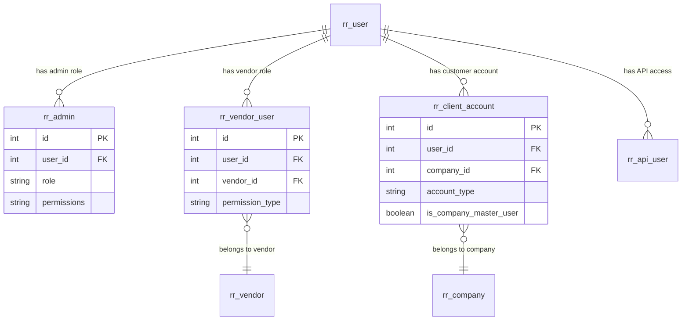
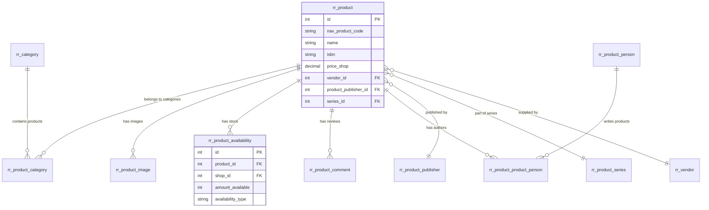
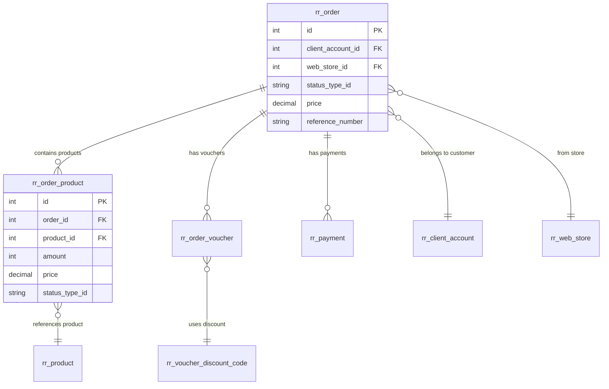
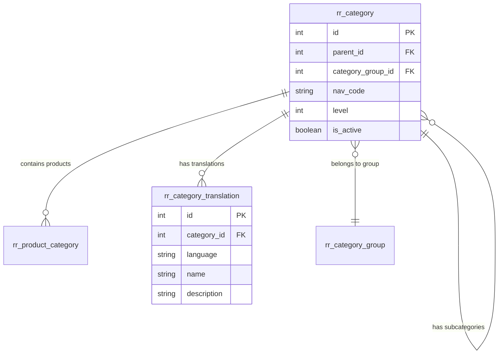
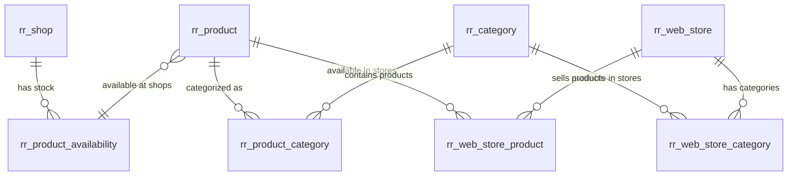
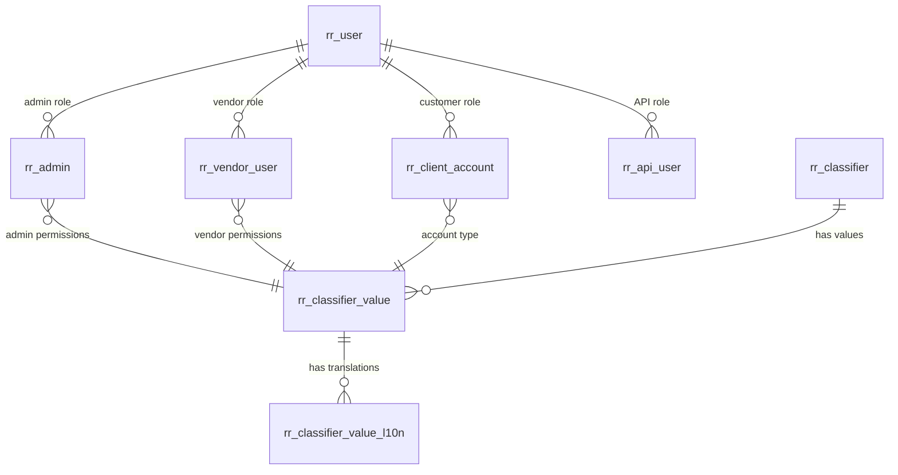
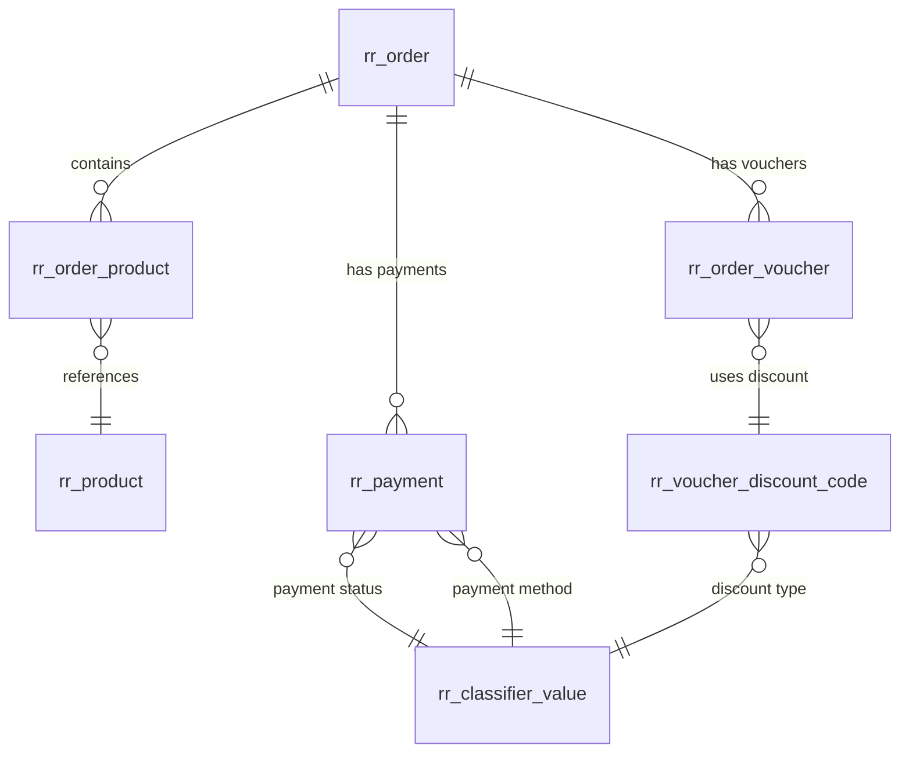

id: DATABASE_SCHEMA
title: DATABASE SCHEMA
# Database Schema Documentation

## Schema Source

The database schema is defined in the following source files:

- **Primary Schema**: `console/migrations/data/init-schema.sql` - Complete database structure with all tables
- **Migrations**: `console/migrations/` - Individual migration files for schema changes
- **Migration Scripts**: `console/models/migrations/` - Data migration scripts for importing legacy data

## Table Prefix

All application tables use the prefix **`rr_`** (Rahvaraamat).

**Example**: `rr_user`, `rr_product`, `rr_order`, etc.

## Key Tables

### User Management Tables

#### Core User Tables
- **`rr_user`** - Main user accounts with authentication details
- **`rr_admin`** - Administrative user accounts and permissions
- **`rr_vendor`** - Vendor/publisher accounts and information
- **`rr_client_account`** - Customer accounts with business/wholesale types
- **`rr_vendor_user`** - Vendor user associations and permissions
- **`rr_user_device`** - User device tracking for sessions
- **`rr_user_failed_login`** - Failed login attempt tracking

#### User Authentication
- **`rr_user_additional_authentication`** - Additional authentication methods
- **`rr_api_user`** - API user accounts and access tokens
- **`rr_api_user_access`** - API access permissions and limits

### Product Management Tables

#### Core Product Tables
- **`rr_product`** - Main product catalog with pricing and metadata
- **`rr_product_availability`** - Stock availability by shop/location
- **`rr_product_image`** - Product images and media files
- **`rr_product_comment`** - Product reviews and comments
- **`rr_product_nav_comment`** - NAV system product comments
- **`rr_product_publisher`** - Publisher information for products
- **`rr_product_series`** - Product series and collections
- **`rr_product_quote`** - Product quotes and excerpts

#### Product Relationships
- **`rr_product_product`** - Related products associations
- **`rr_product_product_person`** - Product-author relationships
- **`rr_product_person`** - Authors, illustrators, and contributors
- **`rr_product_person_meta`** - Additional person metadata

#### Product Statistics
- **`rr_product_sell_statistics`** - Product sales analytics
- **`rr_product_sell_statistics_shop`** - Shop-specific sales data

### Order Management Tables

#### Core Order Tables
- **`rr_order`** - Main order records with status and payment info
- **`rr_order_product`** - Individual products in orders
- **`rr_order_product_download`** - Digital product download tracking
- **`rr_order_voucher`** - Vouchers and discounts applied to orders

#### Payment Tables
- **`rr_payment`** - Payment transactions and status
- **`rr_voucher_discount_code`** - Discount codes and coupons
- **`rr_voucher_gift_card`** - Gift card management

### Category Management Tables

#### Core Category Tables
- **`rr_category`** - Product categories and hierarchy
- **`rr_category_group`** - Category groups for organization
- **`rr_category_translation`** - Multi-language category names
- **`rr_category_group_translation`** - Multi-language group names

#### Category Relationships
- **`rr_category_category_group`** - Category-to-group associations
- **`rr_category_top`** - Featured/top categories
- **`rr_category_map`** - Category mapping and relationships

### Content Management Tables

#### Marketing Content
- **`rr_banner`** - Banner advertisements and promotions
- **`rr_banner_category`** - Banner category associations
- **`rr_banner_stat`** - Banner performance statistics
- **`rr_news`** - News articles and announcements
- **`rr_news_translation`** - Multi-language news content
- **`rr_content_page`** - Static content pages
- **`rr_content_page_translation`** - Multi-language page content

#### Special Offers
- **`rr_special_offer`** - Special offers and promotions
- **`rr_special_offer_product`** - Product-specific offers
- **`rr_special_offer_email_channel`** - Email marketing offers
- **`rr_special_offer_feed_channel`** - RSS/feed offers
- **`rr_special_offer_push_channel`** - Push notification offers

### Subscription Management Tables

#### Subscription Core
- **`rr_subscription_order`** - Subscription order records
- **`rr_subscription_grouped_order`** - Grouped subscription orders
- **`rr_client_account_subscription_offer`** - Subscription offers
- **`rr_client_account_subscription_trial`** - Trial period tracking

### System Tables

#### Configuration Tables
- **`rr_classifier`** - System classifiers and enums
- **`rr_classifier_value`** - Classifier values and options
- **`rr_classifier_value_l10n`** - Multi-language classifier values
- **`rr_system_state`** - System state and configuration
- **`rr_migration`** - Migration tracking table

#### Logging Tables
- **`rr_log`** - General application logs
- **`rr_log_email`** - Email sending logs
- **`rr_log_nav`** - NAV system integration logs

### Business Logic Tables

#### Company Management
- **`rr_company`** - Business customer companies
- **`rr_wholesale_client_discount_group`** - Wholesale pricing groups
- **`rr_wholesale_client_price`** - Wholesale pricing rules

#### Shop Management
- **`rr_shop`** - Physical store locations
- **`rr_shop_translation`** - Multi-language shop information
- **`rr_shop_product_category_location`** - Shop-specific category layouts

#### Delivery Management
- **`rr_delivery_method_price`** - Delivery method pricing
- **`rr_delivery_fee_international`** - International shipping fees
- **`rr_logistic_destination`** - Delivery destinations
- **`rr_logistic_destination_express`** - Express delivery options

### API and Integration Tables

#### API Management
- **`rr_api`** - API configuration and settings
- **`rr_api_partner`** - API partner accounts
- **`rr_api_reseller`** - Reseller API accounts
- **`rr_api_reseller_blacklist`** - Reseller blacklist
- **`rr_api_reseller_category`** - Reseller category permissions
- **`rr_api_reseller_publisher`** - Reseller publisher permissions
- **`rr_api_reseller_user`** - Reseller user accounts

#### External Integrations
- **`__nav_*`** - NAV ERP system integration tables
- **`rr_spool_item`** - Background job queue items
- **`rr_spool_processing_item`** - Processing queue items

## ERD/Relationships

### Core Entity Relationships

#### User Hierarchy


#### Product Relationships


#### Order Relationships


#### Category Hierarchy


### Key Business Relationships

#### Product-Category-Store Relationship


#### User-Role-Permission Relationship


#### Order-Product-Payment Relationship


## Migrations

### Running Migrations

#### Basic Migration Commands
```bash
# Run all pending migrations
php yii migrate

# Run migrations with confirmation
php yii migrate --interactive=1

# Run specific migration
php yii migrate/up 20240101_120000

# Rollback last migration
php yii migrate/down 1

# Show migration history
php yii migrate/history

# Show pending migrations
php yii migrate/new
```

#### Environment-Specific Migrations
```bash
# Run migrations for specific environment
php yii migrate --migrationPath=@console/migrations

# Run OAuth2 migrations
php yii migrate --migrationPath=@console/migrations/oauth2

# Run test migrations
php yii_test migrate
```

#### Data Migration Scripts
```bash
# Run data migration for all entities
php yii data-migration/migrate

# Run specific data migrations
php yii data-migration/migrate-user-data
php yii data-migration/migrate-product-data
php yii data-migration/migrate-order-data
php yii data-migration/migrate-vendor-data
php yii data-migration/migrate-blog-data
```

### Creating New Migrations

#### Generate Migration File
```bash
# Create new migration
php yii migrate/create add_new_table

# Create migration with specific path
php yii migrate/create --migrationPath=@console/migrations add_new_table
```

#### Migration File Structure
```php
<?php

use yii\db\Migration;

class m240101_120000_add_new_table extends Migration
{
    public function up()
    {
        // Create table
        $this->createTable('{{%new_table}}', [
            'id' => $this->primaryKey(),
            'name' => $this->string()->notNull(),
            'description' => $this->text(),
            'created_at' => $this->timestamp()->defaultExpression('CURRENT_TIMESTAMP'),
            'updated_at' => $this->timestamp()->defaultExpression('CURRENT_TIMESTAMP ON UPDATE CURRENT_TIMESTAMP'),
        ]);

        // Add indexes
        $this->createIndex('idx_new_table_name', '{{%new_table}}', 'name');
        
        // Add foreign key
        $this->addForeignKey(
            'fk_new_table_user_id',
            '{{%new_table}}',
            'user_id',
            '{{%user}}',
            'id',
            'CASCADE',
            'CASCADE'
        );
    }

    public function down()
    {
        // Drop foreign key
        $this->dropForeignKey('fk_new_table_user_id', '{{%new_table}}');
        
        // Drop indexes
        $this->dropIndex('idx_new_table_name', '{{%new_table}}');
        
        // Drop table
        $this->dropTable('{{%new_table}}');
    }
}
```

#### Migration Best Practices

1. **Always include `down()` method** for rollback capability
2. **Use table prefix** `{{%table_name}}` for consistency
3. **Add proper indexes** for performance
4. **Include foreign key constraints** for data integrity
5. **Use descriptive migration names** with timestamps
6. **Test migrations** in development before production

#### Common Migration Patterns

**Adding Columns**
```php
public function up()
{
    $this->addColumn('{{%table}}', 'new_column', $this->string(255));
    $this->addColumn('{{%table}}', 'is_active', $this->boolean()->defaultValue(true));
}

public function down()
{
    $this->dropColumn('{{%table}}', 'new_column');
    $this->dropColumn('{{%table}}', 'is_active');
}
```

**Modifying Columns**
```php
public function up()
{
    $this->alterColumn('{{%table}}', 'column_name', $this->string(500));
    $this->alterColumn('{{%table}}', 'status', $this->integer()->notNull()->defaultValue(1));
}

public function down()
{
    $this->alterColumn('{{%table}}', 'column_name', $this->string(255));
    $this->alterColumn('{{%table}}', 'status', $this->string(50));
}
```

**Creating Indexes**
```php
public function up()
{
    $this->createIndex('idx_table_column', '{{%table}}', 'column');
    $this->createIndex('idx_table_multiple', '{{%table}}', ['col1', 'col2']);
    $this->createUniqueIndex('idx_table_unique', '{{%table}}', 'unique_column');
}

public function down()
{
    $this->dropIndex('idx_table_column', '{{%table}}');
    $this->dropIndex('idx_table_multiple', '{{%table}}');
    $this->dropIndex('idx_table_unique', '{{%table}}');
}
```

**Adding Foreign Keys**
```php
public function up()
{
    $this->addForeignKey(
        'fk_table_reference',
        '{{%table}}',
        'reference_id',
        '{{%reference_table}}',
        'id',
        'CASCADE',
        'CASCADE'
    );
}

public function down()
{
    $this->dropForeignKey('fk_table_reference', '{{%table}}');
}
```

### Database Import/Export

#### Import Database Dump

**Method 1: Using MySQL Command Line**
```bash
# Create database first (if not exists)
mysql -u root -p -e "CREATE DATABASE rahvaraamat CHARACTER SET utf8mb4 COLLATE utf8mb4_unicode_ci;"

# Import database dump
mysql -u root -p rahvaraamat < /path/to/your/database_dump.sql

# Or with specific user
mysql -u rahvaraamat_user -p rahvaraamat < /path/to/your/database_dump.sql
```

**Method 2: Using Yii Console Command**
```bash
# Import complete database
php yii db/import @console/migrations/data/init-schema.sql

# Import specific dump file
php yii db/import /path/to/dump.sql
```

**Method 3: Using phpMyAdmin**
1. Open phpMyAdmin in your browser
2. Create new database named `rahvaraamat`
3. Select the database
4. Go to "Import" tab
5. Choose your SQL dump file
6. Click "Go" to import

**Method 4: Using MySQL Workbench**
1. Open MySQL Workbench
2. Connect to your MySQL server
3. Create new schema named `rahvaraamat`
4. Go to Server → Data Import
5. Select "Import from Self-Contained File"
6. Choose your SQL dump file
7. Select target schema
8. Click "Start Import"

#### Common Import Problems and Solutions

**Problem 1: Character Encoding Issues**
```bash
# Error: Incorrect string value for column
# Solution: Set proper character encoding
mysql -u root -p --default-character-set=utf8mb4 rahvaraamat < dump.sql

# Or set in MySQL configuration
[mysql]
default-character-set=utf8mb4

[mysqld]
character-set-server=utf8mb4
collation-server=utf8mb4_unicode_ci
```

**Problem 2: Foreign Key Constraint Errors**
```bash
# Error: Cannot add or update a child row: a foreign key constraint fails
# Solution: Temporarily disable foreign key checks
mysql -u root -p rahvaraamat -e "SET FOREIGN_KEY_CHECKS = 0;"
mysql -u root -p rahvaraamat < dump.sql
mysql -u root -p rahvaraamat -e "SET FOREIGN_KEY_CHECKS = 1;"
```

**Problem 3: Large File Import Timeout**
```bash
# Error: MySQL server has gone away
# Solution: Increase timeout and packet size
mysql -u root -p --max_allowed_packet=1G --net_read_timeout=3600 --net_write_timeout=3600 rahvaraamat < large_dump.sql

# Or set in MySQL configuration
[mysqld]
max_allowed_packet=1G
net_read_timeout=3600
net_write_timeout=3600
```

**Problem 4: Memory Issues**
```bash
# Error: Out of memory
# Solution: Split large dump file
split -l 1000 large_dump.sql dump_part_

# Import parts one by one
for file in dump_part_*; do
    mysql -u root -p rahvaraamat < "$file"
done
```

**Problem 5: Duplicate Entry Errors**
```bash
# Error: Duplicate entry for key
# Solution: Use REPLACE or IGNORE
mysql -u root -p rahvaraamat --force < dump.sql

# Or modify dump file to use REPLACE
sed 's/INSERT INTO/REPLACE INTO/g' dump.sql > dump_fixed.sql
mysql -u root -p rahvaraamat < dump_fixed.sql
```

**Problem 6: Permission Denied**
```bash
# Error: Access denied for user
# Solution: Grant proper permissions
mysql -u root -p -e "GRANT ALL PRIVILEGES ON rahvaraamat.* TO 'rahvaraamat_user'@'localhost';"
mysql -u root -p -e "FLUSH PRIVILEGES;"
```

#### Import Verification Commands

**Check Import Success**
```bash
# Verify database exists
mysql -u root -p -e "SHOW DATABASES LIKE 'rahvaraamat';"

# Check table count
mysql -u root -p rahvaraamat -e "SELECT COUNT(*) as table_count FROM information_schema.tables WHERE table_schema = 'rahvaraamat';"

# Check key tables exist
mysql -u root -p rahvaraamat -e "SHOW TABLES LIKE 'rr_%';"

# Check data in main tables
mysql -u root -p rahvaraamat -e "SELECT COUNT(*) as user_count FROM rr_user;"
mysql -u root -p rahvaraamat -e "SELECT COUNT(*) as product_count FROM rr_product;"
mysql -u root -p rahvaraamat -e "SELECT COUNT(*) as order_count FROM \`rr_order\`;"
```

**Check Database Size**
```bash
# Get database size
mysql -u root -p -e "
SELECT 
    table_schema AS 'Database',
    ROUND(SUM(data_length + index_length) / 1024 / 1024, 2) AS 'Size (MB)'
FROM information_schema.tables 
WHERE table_schema = 'rahvaraamat'
GROUP BY table_schema;
"
```

#### Export Database

**Complete Database Export**
```bash
# Export with proper encoding
mysqldump -u root -p --default-character-set=utf8mb4 --single-transaction --routines --triggers rahvaraamat > backup_$(date +%Y%m%d_%H%M%S).sql

# Export specific tables
mysqldump -u root -p --default-character-set=utf8mb4 rahvaraamat rr_user rr_product rr_order > specific_tables_backup.sql

# Export structure only (no data)
mysqldump -u root -p --no-data --default-character-set=utf8mb4 rahvaraamat > structure_only.sql

# Export data only (no structure)
mysqldump -u root -p --no-create-info --default-character-set=utf8mb4 rahvaraamat > data_only.sql
```

**Compressed Export**
```bash
# Export with compression
mysqldump -u root -p --default-character-set=utf8mb4 rahvaraamat | gzip > backup_$(date +%Y%m%d_%H%M%S).sql.gz

# Import compressed backup
gunzip -c backup.sql.gz | mysql -u root -p rahvaraamat
```

#### Database Backup Scripts

**Automated Backup Script**
```bash
#!/bin/bash
# backup_database.sh

DB_NAME="rahvaraamat"
DB_USER="root"
BACKUP_DIR="/path/to/backups"
DATE=$(date +%Y%m%d_%H%M%S)

# Create backup directory
mkdir -p $BACKUP_DIR

# Create backup
mysqldump -u $DB_USER -p --default-character-set=utf8mb4 \
    --single-transaction --routines --triggers \
    $DB_NAME > $BACKUP_DIR/backup_$DATE.sql

# Compress backup
gzip $BACKUP_DIR/backup_$DATE.sql

# Remove old backups (keep last 7 days)
find $BACKUP_DIR -name "backup_*.sql.gz" -mtime +7 -delete

echo "Backup completed: backup_$DATE.sql.gz"
```

**Restore Script**
```bash
#!/bin/bash
# restore_database.sh

DB_NAME="rahvaraamat"
DB_USER="root"
BACKUP_FILE="$1"

if [ -z "$BACKUP_FILE" ]; then
    echo "Usage: $0 <backup_file>"
    exit 1
fi

# Check if file exists
if [ ! -f "$BACKUP_FILE" ]; then
    echo "Backup file not found: $BACKUP_FILE"
    exit 1
fi

# Restore database
if [[ "$BACKUP_FILE" == *.gz ]]; then
    gunzip -c "$BACKUP_FILE" | mysql -u $DB_USER -p $DB_NAME
else
    mysql -u $DB_USER -p $DB_NAME < "$BACKUP_FILE"
fi

echo "Database restored from: $BACKUP_FILE"
```

### Migration Troubleshooting

#### Common Issues

1. **Migration Already Applied**
```bash
# Check migration history
php yii migrate/history

# Remove from migration table if needed
DELETE FROM rr_migration WHERE version = 'migration_name';
```

2. **Foreign Key Constraints**
```bash
# Disable foreign key checks temporarily
SET FOREIGN_KEY_CHECKS = 0;
-- Run migration
SET FOREIGN_KEY_CHECKS = 1;
```

3. **Large Data Migrations**
```php
// Use batch processing for large datasets
foreach ($this->getData() as $batch) {
    $this->batchInsert('{{%table}}', ['col1', 'col2'], $batch);
}
```

4. **Memory Issues**
```php
// Increase memory limit for large migrations
ini_set('memory_limit', '1G');
```

---

*This comprehensive database schema documentation provides a complete overview of the Rahvaraamat e-commerce backend database structure, relationships, and migration management.* 
