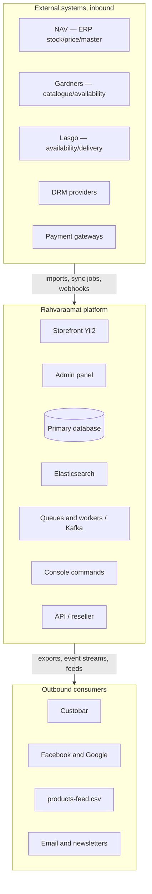

# Onboarding pack

Everything needed to take ownership of delivery on this platform: what the business is, how the systems fit together, how work moves, where the known fragile areas are, and what to read before touching anything.

:::tip Start here
New to Rahva Raamat? Read this pack first, then follow the [Local Setup Roadmap](./LOCAL_SETUP.md). Gap coverage lives separately in [Gap Documents](/gaps/intro).
:::

## 00 — Read this first

### The five minute version

**One shop, many sources of truth, on a framework that has stopped moving.**

Rahvaraamat is **Estonia's largest bookstore platform**. It serves consumers and business customers from the same storefront, sells physical books, digital media and non book products, and depends on a set of external systems for the facts it displays:

- **NAV** for stock and price
- **Supplier feeds** for availability and delivery times
- **Elasticsearch** for anything a customer searches or filters
- **Custobar** for customer and campaign data

The platform runs on **Yii2**, a PHP framework whose development has effectively stalled. There is no framework level home for retry logic, scheduling, reconciliation or shared visibility rules, so those behaviours were built once per integration. That single fact explains most of what you will see on the board: the same class of bug returns in a different place, and every investigation starts by ruling out four layers that do not report their own health.

Your job in the first month is not to fix that. It is to learn the layers well enough to triage fast, and to protect roadmap capacity from being fully consumed by corrective work.

---

## 01 — What Rahvaraamat is

Understanding the commercial shape of the business explains why the technical edge cases exist.

### Customer types

- **Consumer (B2C).** The default path. Heavily exercised by traffic, so regressions here are usually caught quickly.
- **Business customer (äriklient).** Own application process, own pricing, own shipping rules, and a different visible catalogue. Thin test coverage. A disproportionate share of bugs originate here.
- **Wholesale.** Separate shipping time management and contact handling.
- **Loyalty customer (püsiklient).** Account linked benefits, tied into sign up and email flows.
- **Resellers.** Consume a documented API and product feed rather than the storefront. See the reseller API guide, currently at v1.1.

### Product types

- **Physical books.** Sourced both from local stock and from external suppliers such as Gardners and Lasgo, each with its own availability and delivery window rules.
- **Digital media.** E-books and audiobooks, with DRM dependencies. This is the most externally coupled part of the platform.
- **Non book products.** Behave differently in search, which is why synonym and fuzzy matching work exists specifically for them.

### Why this matters technically

Almost every hard bug on this platform is the intersection of a customer type and a product type. A title that displays correctly for a consumer can vanish for a business customer, because visibility and pricing are resolved in more than one layer and those layers do not always agree. When a report arrives, the first two questions are always: **which customer type**, and **which product type**.

---

## 02 — People and who to ask

| Person | Role | Go to them for |
| --- | --- | --- |
| Kenno | Technical lead, client side | Architecture decisions, production access, history of why something was built the way it was, sign off on technical approach. |
| Jürgen | Manager, client side | Priority calls, scope and commercial questions, anything that changes the shape of the plan. |
| `name` | Business and merchandising | Catalogue rules, supplier relationships, campaign and pricing intent. |
| `name` | Gaincafe delivery lead | Day to day delivery, ticket flow, developer allocation. |
| `names` | Developers on the platform | Module ownership. Fill in who currently knows which area best. |

:::warning Fill before sharing
Highlighted `` `name` `` / `` `names` `` slots (and similar placeholders elsewhere) are incomplete. Complete them with current names, links and system URLs before handing this to an incoming person, so their first week is not spent asking who owns what.
:::

---

## 03 — System map and where truth lives

Read this section twice. Nearly every incident is a disagreement between two boxes below.

### Where truth lives

| Fact | System of record | Also cached or copied in |
| --- | --- | --- |
| Stock quantity | NAV | Site database, Elasticsearch, outbound feeds |
| Price and discount | NAV | Site database, category and product pages, feeds |
| Product master data | NAV plus supplier feeds | Site database, Elasticsearch, feeds |
| Availability and delivery window | Supplier feed | Site availability logic, product page |
| Searchability and filters | Elasticsearch | Nowhere. If the index is wrong, the site is wrong. |
| Orders | Site database | NAV, Custobar |
| Customer records and events | Site database | Custobar |
| Digital entitlements | DRM provider | Site database |

**The rule to internalise:** the storefront almost never owns the fact it is displaying. When a number is wrong on the site, the question is which copy is stale, not what the site calculated.

Related docs: [NAV Integration](../integrations/NAV_INTEGRATION.md), [External Integrations](../integrations/EXTERNAL_INTEGRATIONS.md), [Elasticsearch Spool](../integrations/ELASTICSEARCH_SPOOL.md), [Availability](../commerce-ordering/AVAILABILITY.md).

---

## 04 — The stack and the Yii2 constraint

### Current stack

- **Yii2**, PHP — legacy application: storefront, admin panel, console commands, integrations
- **Elasticsearch** — search and filtering
- **Kafka** — messaging in parts of the integration path
- **PM2** — process management for workers and listeners
- **NAV** — ERP integration
- **Laravel** — target framework for the migration, not yet the production runtime

### What the Yii2 situation actually means for you

This is the single most important piece of context for planning.

- **The framework has stopped moving.** New capability is not arriving and maintenance is limited to basic PHP compatibility. The platform gets no benefit from the last several years of PHP ecosystem improvement.
- **No modern primitives.** No first class queue and retry abstraction, no standard scheduler, limited schema migration and testing tooling. Everything of that kind here is hand built.
- **Dependencies age independently.** Several third party packages in this stack are no longer maintained. Each is a pending decision: pin it, fork it, or replace it with local code. All three cost time and produce no visible change for the business.
- **The developer pool is shrinking.** Contracting or hiring for Yii2 gets harder each year. Treat the number of people who can safely change this codebase as a continuity risk, not a staffing detail.
- **It is why bugs recur.** With no shared home for common behaviour, common behaviour was copied. Retry logic exists in several integrations in slightly different forms. Visibility rules are applied in more than one layer. A fix in one path does not protect the others.

:::info How to frame this with stakeholders
The risk is not a dramatic outage. It is a roadmap that quietly stops moving because capacity is fully committed to holding position. When you estimate, expect a legacy tax on anything touching integrations, pricing or visibility, and say so explicitly rather than absorbing it silently.
:::

---

## 05 — Environments and ticket lifecycle

### Environments

| Environment | Purpose | Notes |
| --- | --- | --- |
| Local | Development | [Local Setup Roadmap](./LOCAL_SETUP.md), [Docker Setup](./DOCKER_SETUP.md) |
| Staging | Integrated testing before release | Where client side review happens. Supplier and NAV connections are `confirm: live or mocked`. |
| Production | Live shop | Some verification can only happen here, which is why a live QA stage exists. See [Infrastructure](../infrastructure/INFRASTRUCTURE_OVERVIEW.md). |

### Board statuses, in order

The board is the shared source of truth for status. Statuses are not decorative — each one means a specific handover has happened.

| Status | Means | Exit condition |
| --- | --- | --- |
| To do | Accepted and specified, not started | A developer picks it up |
| In progress | Actively being built | Code complete and self tested |
| In review | Under code or approach review | Review passed |
| Staging | Deployed to staging for verification | Verified by `who verifies` |
| Live QA | Released, being confirmed in production | Confirmed working with real data |
| Complete | Done and accepted | Closed |

Live QA exists because a meaningful share of behaviour depends on real supplier data, real NAV state and real customer group configuration. Staging can prove the code runs. It cannot always prove the outcome is right.

### Priority scheme

- **Urgent.** Revenue is blocked right now: checkout, orders, login. Drop other work.
- **High.** A customer facing defect with a workaround, or a fix that removes a recurring cost.
- **Normal.** Planned work, improvements, investigations.
- **Unset.** Not yet triaged. Treat an unset priority as an open triage task for you, not as low priority.

---

## 06 — How work actually flows

The written process and the real process are usually different. This is the real one.

- **Reports arrive in business language, not technical language.** "This book is not on the site." "A customer cannot order." "The price is wrong." Almost never with a customer type, product type or timestamp attached. Getting those three facts is the first job on every ticket.
- **Many tickets are investigations, not builds.** Several items on the board at any time are titled "investigate" or "research" for good reason: the cause is genuinely unknown at intake. Size these differently from build work and do not let them sit unset.
- **Urgent items pre-empt everything.** When an order or login failure lands, it clears first. This is correct, and it is also the main reason planned work slips. Track that displacement so it is visible rather than assumed.
- **Verification often needs a real customer scenario.** Business customer bugs in particular need a test account of the right type. Get access to test accounts for each customer type early.

### Recurring rhythms to confirm and put in your calendar

- Standup or sync with the client team: `cadence and time`
- Release window: `cadence`
- Priority review with Jürgen: `cadence`
- Technical review with Kenno: `cadence`

---

## 07 — Triage playbook

The most common report on this platform is some version of "a product is missing or wrong on the site". There are at least five places that can cause it, and none of them announces itself. Work the ladder in order.

1. **Did NAV ever send it?**  
   Check the product exists in NAV with the expected stock and price, and that the last sync for that record succeeded.

2. **Did the supplier feed include it?**  
   Check the relevant supplier import for that title. Gardners and Lasgo each have their own inclusion and delivery window rules.

3. **Did indexing reach it?**  
   Compare the database record against the Elasticsearch document. Check whether an indexing run was interrupted, and whether workers or listeners are alive.

4. **Is a visibility rule filtering it?**  
   Reproduce as the exact customer type in the report, especially business customer. Consumer and business paths resolve visibility differently.

5. **Did availability logic decide it is unavailable?**  
   Check the computed availability state and the inputs it used, including supplier delivery windows.

:::tip Practical note
Ruling out these five layers by hand is the largest single consumer of engineering time here, and it never appears as its own line on a ticket. Any work that makes a layer report its own health — such as Elasticsearch monitoring or a NAV reconciliation pass — pays for itself across every future report. Argue for that work on those grounds.
:::

### Second common report: "something is not reaching an external system"

Usually Custobar or an outbound channel feed. Order of checks:

1. Did the event fire?
2. Did the job get queued?
3. Is the worker alive?
4. Did the payload contain the required fields?
5. Did the credential expire?

Silent credential expiry has bitten this platform before, on the Facebook and Google keys.

---

## 08 — Issue classes to expect

Over a recent cycle of 32 tracked items, the work sorted into seven recurring classes. Expect roughly this distribution to continue.

| Class | Share | What it looks like |
| --- | --- | --- |
| Product data and visibility | Largest | Product exists and has stock but is invisible, mispriced on the page, or undescribed. |
| Integration and sync | Second largest | NAV, supplier feeds, Custobar, outbound channel feeds. Failures are silent. |
| Accounts, orders, checkout | Low volume, highest urgency | Login failures, orders not completing. Every item here blocks revenue. |
| Business and wholesale flows | Steady | B2B application, pricing, shipping rules, catalogue visibility. |
| Search and infrastructure | Steady | Elasticsearch instability, worker and listener crashes, index drift. |
| Marketing and content automation | Steady | Newsletters, wishlist campaigns, AI generated descriptions, storefront AI friendliness. |
| Regulatory and compliance | Occasional | Non negotiable deadlines, usually touching pricing or order history. |

Two thirds of intake is corrective rather than additive. Plan capacity accordingly, and make the split visible in reporting so the roadmap conversation stays honest.

---

## 09 — Landmines and fragile areas

Ask before changing anything in these areas, and never ship them without a real scenario test.

| Area | Why it is fragile |
| --- | --- |
| **Customer group visibility and pricing** | Resolved in more than one layer. Changing one layer can silently alter what a business customer sees. Source of the Gardners disappearance and the discounted price display issues. |
| **Queue workers and listeners** | Run under PM2. When a listener crashes it stays down and nothing alerts. The work it was carrying is simply not done, and the symptom appears somewhere else entirely. See [PM2 Process Management](../infrastructure/IN-002-PM2-PROCESS-MANAGEMENT.md). |
| **Elasticsearch index integrity** | Drifts from the database when indexing is interrupted. Heap pressure has caused instability. Hardening work covering monitoring, spool recovery and auto restart is in flight. See [Elasticsearch Spool](../integrations/ELASTICSEARCH_SPOOL.md). |
| **NAV sync** | Point to point with no reconciliation pass. Nothing confirms that both sides agree after a run. Wrong numbers are found by people, not by systems. |
| **Supplier feed inclusion rules** | No per supplier diff of what appeared and disappeared in an import. Titles can drop out for a specific customer group without any error being raised. |
| **Digital media and DRM** | The most externally coupled area. Behaviour depends on third party providers, which limits what can be tested outside production. |
| **Outbound channel credentials** | Facebook and Google keys have expired without warning before. Treat credential rotation as scheduled work with an owner, not as an incident waiting to happen. |
| **Foreign key and data integrity in legacy tables** | Historic logic layered over pricing and order history. Highest chance of an unexpected dependency, and the primary risk area in the migration. |

---

## 10 — Migration context

A Yii2 to Laravel migration has been proposed and structured. You do not need to own it in week one, but you need to know its shape, because it affects how you sequence current work.

The proposal is ordered easiest wins first, so that value and confidence arrive early and the hardest coupling is faced with a proven foundation in place. Indicative duration is 6 to 8 months with several developers working in parallel.

| Phase | Focus | Notes |
| --- | --- | --- |
| Phase 1 | Foundation | Framework base, structure, conventions |
| Phase 2 | Admin panel | Internal surface first, lower blast radius |
| Phase 3 | Read only API | No write risk while patterns settle |
| Phase 4 | Write API and auth | Where correctness starts to matter |
| Phase 5 | NAV, suppliers, console | The integration layer and batch jobs |
| Phase 6 | Digital media | DRM and external coupling |
| Phase 7 | Testing and cutover | Verification and switch |

**Practical implication for current work:** when a fix touches integrations, retry behaviour or visibility rules, ask whether it should be built in a way that survives the migration or deliberately kept minimal because that code is scheduled for replacement. Get that call agreed with Kenno rather than deciding it per ticket.

---

## 11 — Day one access checklist

Nothing below should take more than a day to arrange. Chase anything still missing at the end of week one, because each gap blocks a whole class of work.

| Access | Needed for | Request from |
| --- | --- | --- |
| Ticket board | Everything | `owner` |
| Code repositories | Review, history, context | Kenno |
| Staging environment | Verification | `owner` |
| Production read access and logs | Triage | Kenno |
| Admin panel account | Reproducing catalogue issues | `owner` |
| Elasticsearch and monitoring dashboards | Index and infrastructure triage | `owner` |
| Test accounts: consumer, business, wholesale, loyalty | Reproducing customer specific bugs | `owner` |
| NAV visibility, read only if possible | Confirming source of truth | Kenno |
| Custobar | Verifying customer and event sync | `owner` |
| Communication channels | Day to day | `owner` |

### Documents to read, in this order

1. **This pack** (you are here)
2. Platform status and issue landscape review, current cycle
3. [Project Overview](../reference/01-PROJECT_OVERVIEW.md) / technical architecture reference
4. Reseller API guide, v1.1, plus the related tickets kept as separate documents — see also [API Documentation](../reference/05-API_DOCUMENTATION.md)
5. Integration tracker spreadsheet — start from [External Integrations](../integrations/EXTERNAL_INTEGRATIONS.md)
6. Yii2 to Laravel migration proposal (section [10](#10--migration-context) above)
7. [Gap Documents](/gaps/intro) — so you know what is documented and what is not

Then set up the machine with the [Local Setup Roadmap](./LOCAL_SETUP.md).

---

## 12 — First 30 days

### Week 1 — Orient

- Complete the access checklist and flag anything blocked.
- Read the documents listed above, in order.
- Meet Kenno and Jürgen. Confirm the recurring rhythms and who decides priority.
- Walk the board item by item and make sure every open ticket has a priority, an owner and a clear customer type in scope.
- Reproduce one live bug end to end using the [triage ladder](#07--triage-playbook). Do not delegate this. It is the fastest way to learn the layers.

### Week 2 — Trace

- Trace one full data path yourself: NAV → database → Elasticsearch → product page, for a single title.
- Trace one outbound path: an order to Custobar.
- Sit with each developer and write down what they own and what only they know. Feed this into the [Gap Documents](/gaps/intro) tracker.
- Reproduce the same product as a consumer and as a business customer, and note every difference.

### Weeks 3 and 4 — Own

- Take the priority conversation with Jürgen yourself.
- Publish a corrective versus additive split of the board so capacity displacement is visible.
- Propose the first two reliability items to fund: alerting on worker death, and a reconciliation pass on one sync path. These remove branches from the triage ladder permanently.
- Agree with Kenno on the standing rule for whether fixes in migration scoped areas are built to last or kept minimal.
- Close the top three gaps in the KT tracker while the outgoing context is still available.

---

## 13 — Glossary

Estonian appears in ticket titles and client conversation, so the common terms are worth knowing on sight.

| Term | Meaning |
| --- | --- |
| **Rahvaraamat** *(Estonian)* | The platform and brand. Literally people's book. |
| **e-pood / epood** *(Estonian)* | Online shop. Appears as a ticket tag. |
| **äriklient** *(Estonian)* | Business customer. Ärikliendi is the possessive form. |
| **püsiklient** *(Estonian)* | Loyalty or regular customer. |
| **uudiskiri** *(Estonian)* | Newsletter. |
| **sisuleht** *(Estonian)* | Content page. |
| **teekond** *(Estonian)* | Journey, as in a customer or message journey. |
| **jõudmine** *(Estonian)* | Arrival or reaching, as in data reaching a system. |
| **NAV** | The ERP. System of record for stock, price and product master data. |
| **Custobar** | CRM and marketing automation platform receiving customers, orders and events. |
| **Gardners, Lasgo** | External book suppliers, each with its own feed, inclusion rules and delivery windows. |
| **DRM** | Digital rights management for e-books and audiobooks. Externally provided. |
| **products-feed.csv** | Outbound product feed consumed by resellers and channels. |
| **Spool** | The queued indexing work Elasticsearch has yet to apply. Spool recovery means resuming it after an interruption. |
| **Live QA** | Board stage for verifying a release against real production data. |
| **Legacy tax** | Shorthand for the extra effort a change costs because it lands in the Yii2 codebase rather than a modern one. |

Also see the full [Glossary](../faq/16-GLOSSARY.md).

---

## 14 — Open KT gaps

What this pack does not yet cover. Close these while the outgoing context is still available, and track them in [Gap Documents](/gaps/intro) rather than holding them in anyone's head.

- **Runbooks.** Is there a written procedure for restarting workers, reindexing Elasticsearch, and re-running a failed supplier import? If not, write them as you first do each one.
- **Deployment and rollback.** Who deploys, on what cadence, and what is the actual rollback path if a release goes wrong. Start from [Deployment Guide](../deployment/11-DEPLOYMENT_GUIDE.md).
- **Monitoring and alerting coverage.** What is currently alerted, who receives it, and what is silent. See [Monitoring & Alerting](../infrastructure/IN-006-MONITORING-ALERTING.md).
- **Credential inventory.** Which external credentials exist, who owns each, and when each expires.
- **Module ownership.** Which developer is the only person who understands a given area. Every single point of knowledge is a delivery risk.
- **Business rules not written down anywhere.** Particularly pricing, buy back, and customer group catalogue visibility.
- **Historical decisions.** Why certain integrations were built the way they were. Kenno is the main source and this is worth capturing rather than rediscovering.

---

*Rahvaraamat knowledge transfer and onboarding pack, v1.0 — 29 July 2026*
